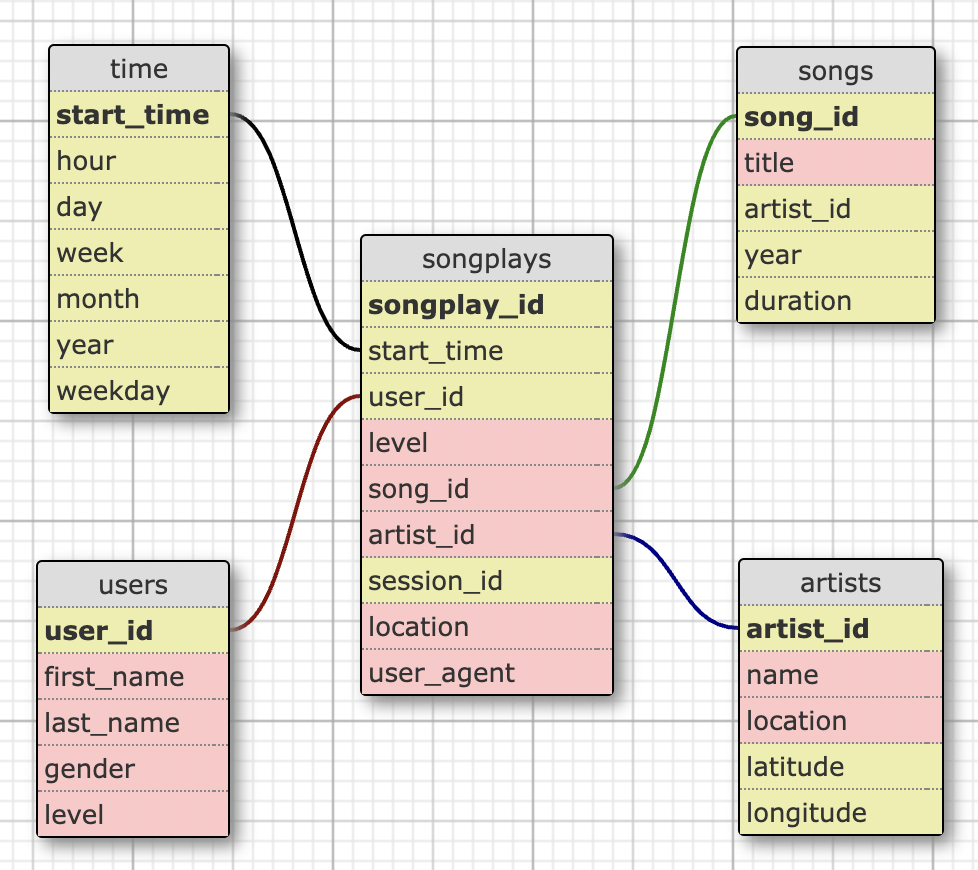

# Data Modeling with Postgres

## Introduction

For this project I build a Postgres database for the fictitious music streaming app **SPARKIFY**. It was part of my *Udacity Nanodegree in Data Engineering*.

## The Task

To better understand their listeners preferences and to provide them with the best content, Sparkify has been collecting data about listener activity and stores data about the songs in their app. 
To provide the Sparkify analytics team with an easy way to analyse and query this data, it needs to be converted from the current JSON format into structured database.

## The Datasets

The database is based on two datasets. 
- **The song dataset** is a subset of real data from the [Million Song Dataset](http://millionsongdataset.com/). Each file is in JSON format and contains metadata about a song and the artist of that song. The files are partitioned by the first three letters of each song's track ID. 
- **The logfile dataset** consists of log files in JSON format generated by an [Event Simulator](https://github.com/Interana/eventsim) based on the songs in the song dataset. It simulates activity logs from a music streaming app based on specified configurations. The log files are partitioned by year and month.

## The Database Schema

The database (db) is modeled after the star schema. [The Star Schema](https://en.wikipedia.org/wiki/Star_schema) separates business process data into facts, which hold the measurable, quantitative data about a business, and dimensions which are descriptive attributes related to fact data. 

For the Sparkify database we have the 'songplays' table as the fact table and the 'songs', 'artists', 'users', and 'time' tables as dimension tabels, shown also in the ERD in the following image: 

## The ETL Pipeline

The perform all necessary tasks for the ETL processes there are three files:

1. **`sql_queries.py`** contains all necessary sql queries to create, populate, and delete the database and its tables
2. **`create_tables.py`** accesses the sql queries to first drop an existing version of the Sparkify db and then newly creates the db and its tables
3. **`etl.py`** opens the JSON files and populates the db tables with the respective data

## Song Play Analysis

I also provided some basic analysis queries in the notebook analyse_data.ipynb.
